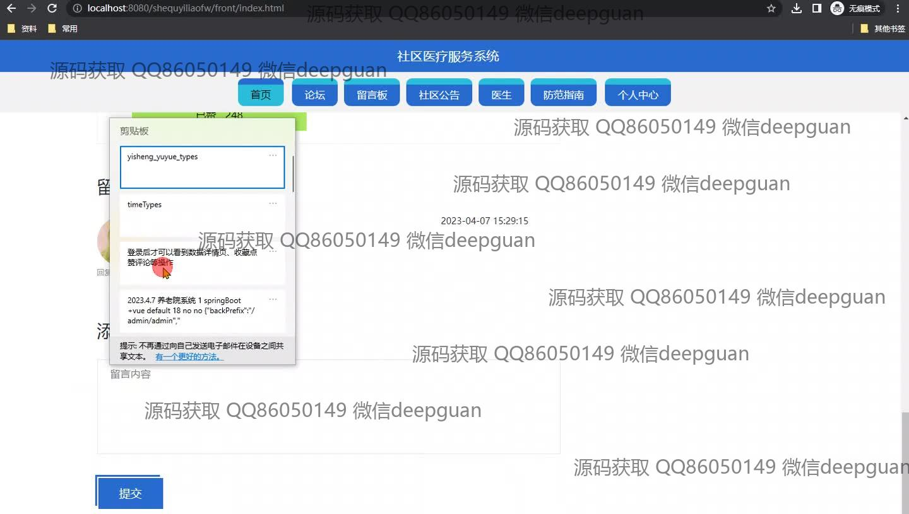
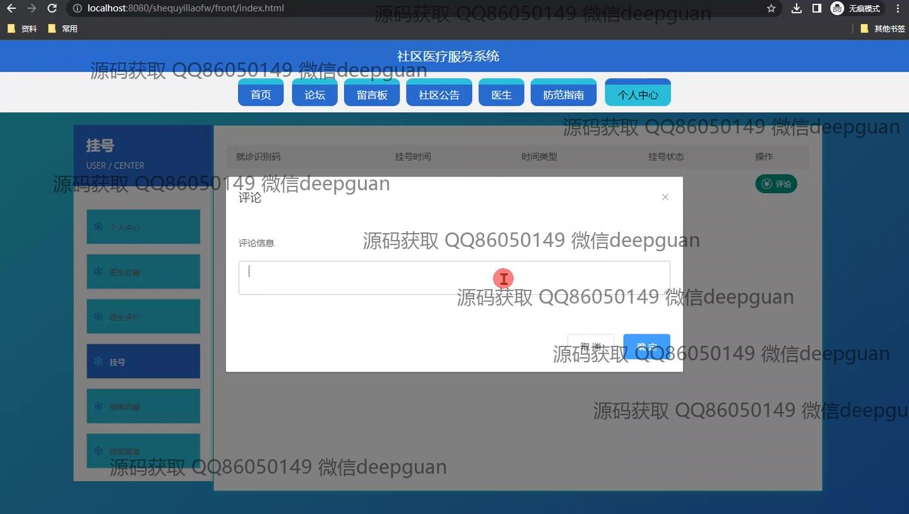

<h1 align="center">社区医疗服务系统</h1>

## 简介
社区医疗服务系统：角色包括管理员和用户，提供医生信息展示、预约管理、在线咨询、论坛互动、留言板、社区公告、防疫指南及个人中心等功能，提升用户在社区医疗领域的交流与服务体验。    --计算机毕业设计源码；毕设源码；java毕业设计源码

## 联系方式

<h3 align="center">获取完整代码与数据库文件 + 微信：deepguan QQ: 86050149 QQ群: 783742310</h3>

<h3 align="center">可帮忙远程部署 包运行成功！提供远程部署、修改代码、设计文档指导、代码讲解等服务！</h3>

## 功能介绍（完整见运行截图）
管理员：提供医生管理、用户管理、挂号管理、社区公告管理、防疫指南管理、论坛管理等模块功能，可对医生信息、用户咨询、挂号记录进行查看、回复、删除或修改，有权限管理论坛帖子和防疫指南，负责全系统数据更新与维护。用户：支持登录、注册、留言、反馈、修改信息等功能，在首页、论坛、留言板、医生信息、防疫指南等模块下进行信息浏览、医生评价、预约挂号、药品查询，参与社区互动。医生：可以在平台查看个人信息、用户评价，并通过用户咨询模块回复咨询问题，在医生管理模块更新个人资料，包括工号、科室、职称、履历等，同步查看和管理预约信息。游客：未登录用户可以浏览首页和部分模块的公共信息，如论坛帖子、医生介绍、防疫指南等，无法进行互动操作，如留言评论、预约挂号，仅做信息浏览者。

## 运行截图

本代码来源于网络,仅供学习参考使用!

